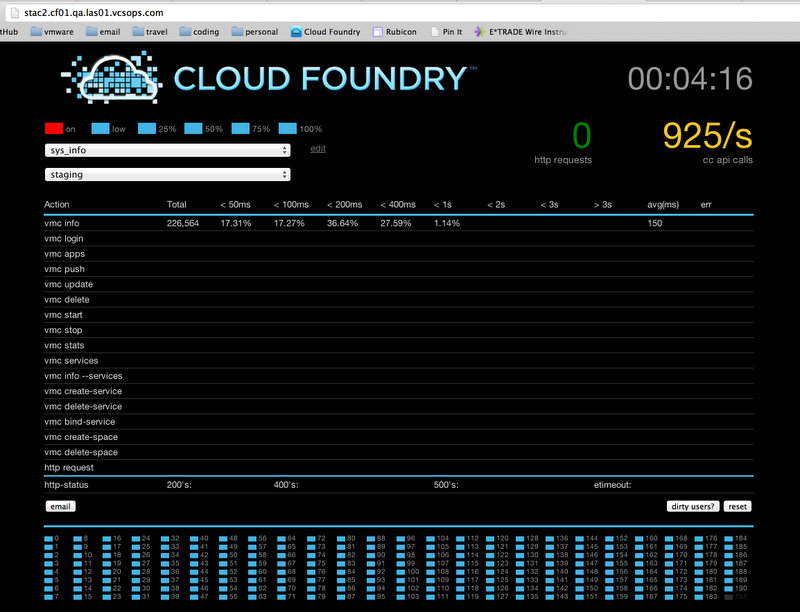

# Stac2

Stac2 is a load generation system for Cloud Foundry. The system is made up for several Cloud Foundry applications. The instance
count of some of the applications gates the amaount of load that can be generated and depending on the size and complexity of your system,
you will have to size these to your Cloud Foundry instance using the "vmc scale --instances" command.

Installing/running Stac2 on your Cloud Foundry instance requires a small amount of configuration and setup.

* clone the stac2 repo "git clone git@github.com:cloudfoundry/stac2.git"
* create a cloud config file for your cloud into nabv/config/clouds
* create user accounts used by stac2 using "vmc register"
* note, you must use vmc version 0.4.2 or higher.
* the idea is to use a single vmc push to create the app and services, BUT 0.4.2 has a bug in service creation so execute the following two vmc service creation commands first. once the service creation issue is fixed, you will not have to do these two manual steps.
    * vmc create-service redis --version 2.2 --name stac2-redis
    * vmc create-service mongodb --version 2.0 --name stac2-mongo
* from the stac2 repo root, where the manifest.yml file is run vmc pus
* based on the size of your cloud and desired concurrency you will need to adjust the instance counts of nabv, nabh, and nf
    * nabv should be sized to closely match the concurrency setting in your cloud config. It should be a little over half your desired concurrecny.
    for a large production cloud with a cmax of 192 set the instance count of nabv to ~100 (vmc scale nabv --instances 100)
    * nabh should be between 16 and 32, depending on how hot of an http load you plan to run, at 32 you can easily overwhelm a small router pool with so a rule of thumb would be to start with 16 for must mid-sized (100+ dea clouds), 32 for 250+ dea clouds, and4-8 for very small clouds
    * nf should be set large IFF you plan on running the high thruput xnf_ loads. Tun run 30,000 http requests per second run between 75 and 100 instances of nf
    * stac2 is a single instance app so leave it at 1

Once stac2 is running and configured correctly, since this is the first time its been run, you need to populate it with some workloads. The static
starter set of workloads are in stac2/config/workloads. The workload selection UI has an "edit" link next to the selector so to initially
populate the default workloads click the "edit" link then the "reset workloads" link, then return the the main screen by clicking
on the "main" link. Note, any time you want to edit/reload the default workloads, just edit the file under stac2/config/workloads, re-push stac2,
and then go through the edit/reset workloads/main cycle. Fine approach for the default workloads. If you just want to change/add a workload you can do this by just uploading a new workload file
on the edit page, or delete and reload an existing workload file. The edit/reset/main path is really just for resetting things to the default state. Apologies for the
ugly edit form. What can I say. Lazy hack session one night when I just wanted to be able to let our ops guys edit/upload a workload so I built a form in an hour.

At this point, assuming your cloud config file is correct, you should be able to run some load. Select the sys_info workload in the workload selection, validate
that the cloud selector correctly selected your cloud, and then click the light gray 100% load button. You should immeadiately see the blue load lights
across the bottom of the screen peg to your max concurrency and you should see the counters in the main screen for the info call show activity. For a reasonable
cloud with reasonable stac2 concurrency seeing ~1,000 CC API calls per second (the yellow counter) should be easily in reach. You should see a screen similar to this:

If you see no activty, then click on the reset button above the load light grid and try again.
* open up the stac2 app in your browser, click on the edit under the 100% marker, click "reset workloads", then "main"
* select the "sys_sniff" workload, then run at 100%

# Components

## stac2

## nabv

## nabh

## nf

# Workloads

# Clouds
